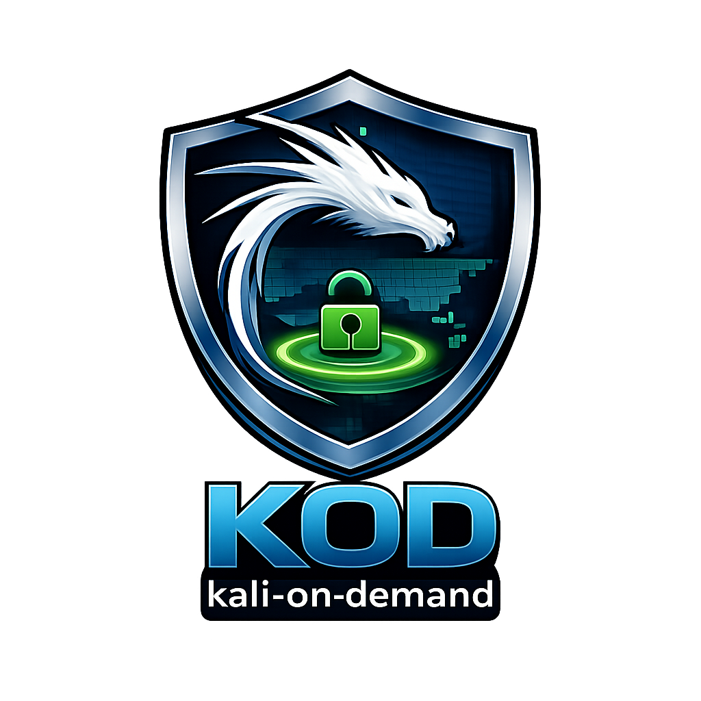

<h1 align="center">
  <a href="https://github.com/jtmb">
    
  </a>
</h1>

<div align="center">
  <b>kali-on-demand (VPN-Isolated)</b> – A reproducible Kali Linux workspace routed entirely through ProtonVPN.
  <br />
  <br />
  <a href="https://github.com/jtmb/kali-bootstrap/issues/new?assignees=&labels=bug&title=bug%3A+">Report a Bug</a>
  ·
  <a href="https://github.com/jtmb/kali-bootstrap/issues/new?assignees=&labels=enhancement&title=feat%3A+">Request a Feature</a>
</div>

<br>

<details open="open">
<summary>Table of Contents</summary>

- [About](#about)
  - [Highlighted Features](#highlighted-features)
- [Prerequisites](#prerequisites)
- [Getting Started](#getting-started)
  - [Architecture Overview](#architecture-overview)
  - [Running on Docker Compose](#running-on-docker-compose)
- [Environment Variables Explained](#environment-variables-explained)
- [Volumes & Persistence](#volumes--persistence)
- [Security Notes](#security-notes)
- [Contributing](#contributing)
- [License](#license)

</details>

---

## About

**Kali Bootstrap** is a Docker-based Kali Linux environment that is **fully routed through ProtonVPN** using the
`qmcgaw/gluetun` container.

It is designed for:

- Offensive security labs
- OSINT & recon workflows
- Wordlists, payload, and tool management
- Reproducible, VPN-isolated research environments

On container startup, repositories defined via environment variables are automatically cloned (or updated) into a persistent volume.

### Highlighted Features

- 🔒 **Full VPN isolation**
- 🧰 **Automatic repo bootstrap**
- 📦 **Persistent storage**
- 🐳 **Docker-native**
- ⚡ **Fast startup**
- 🧠 **Composable**

---

## Prerequisites

- Docker
- Docker Compose
- ProtonVPN account (OpenVPN credentials)

---

## Getting Started

### Architecture Overview

All Kali traffic is routed through ProtonVPN using Gluetun.
If the VPN drops, network access is cut to prevent leaks.

### Running on Docker Compose

Create a `.env` file:

```
PROTONVPN_USERNAME=your_openvpn_username
PROTONVPN_PASSWORD=your_openvpn_password
USERNAME=kali
```

Run:

```
./compose-stack.sh
```

Attach:

```
docker exec -it kali-bootstrap bash
```

---

## Environment Variables Explained

`GIT_REPOS` – List of git repos to clone  
`TZ` – Container timezone  
`PROTONVPN_USERNAME` / `PROTONVPN_PASSWORD` – VPN credentials  
`USERNAME` – Non-root Kali user  

---

## Volumes & Persistence

All cloned repositories persist on the host via volume mounts.

```
    environment:
      GIT_REPOS: >
        "https://github.com/berandal666/Passwords.git"
        "https://github.com/danielmiessler/SecLists.git"
```

---

## Security Notes

- VPN enforced routing
- Non-root user
---

## Contributing

First off, thanks for taking the time to contribute! Contributions are what makes the open-source community such an amazing place to learn, inspire, and create. Any contributions you make will benefit everybody else and are **greatly appreciated**.

Please try to create bug reports that are:

- _Reproducible._ Include steps to reproduce the problem.
- _Specific._ Include as much detail as possible: which version, what environment, etc.
- _Unique._ Do not duplicate existing opened issues.
- _Scoped to a Single Bug._ One bug per report.

## License

This project is licensed under the **GNU GENERAL PUBLIC LICENSE v3**. Feel free to edit and distribute this template as you like.

See [LICENSE](LICENSE) for more information. 